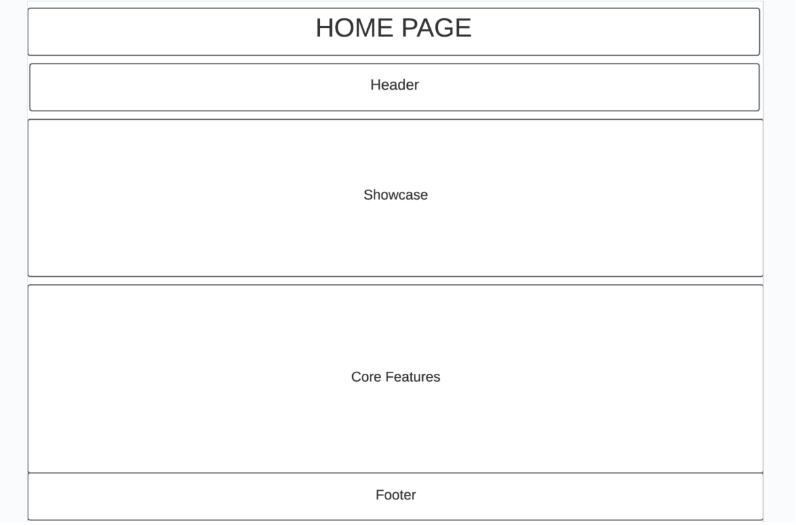
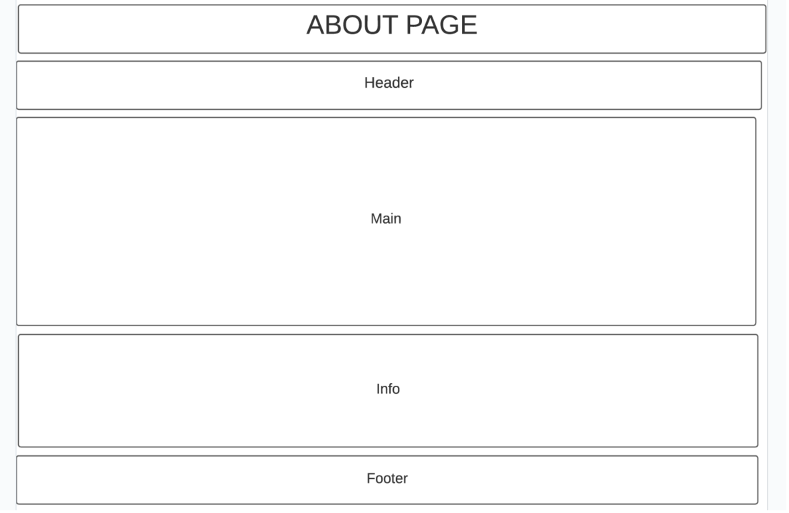
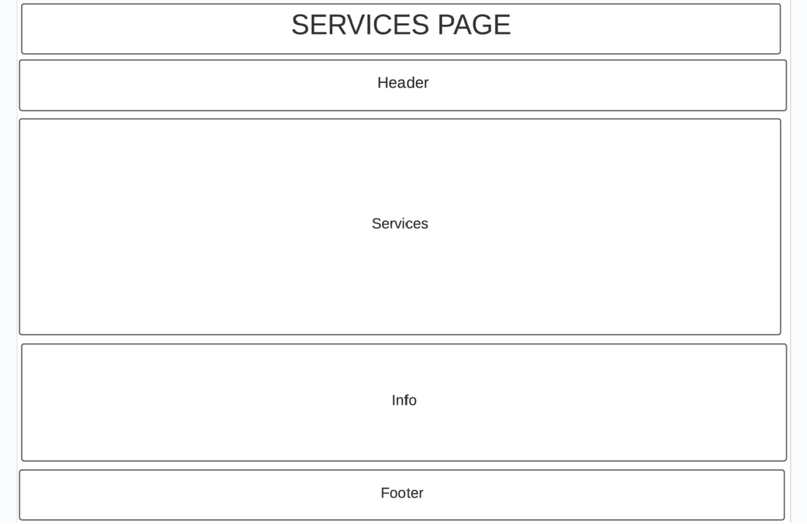
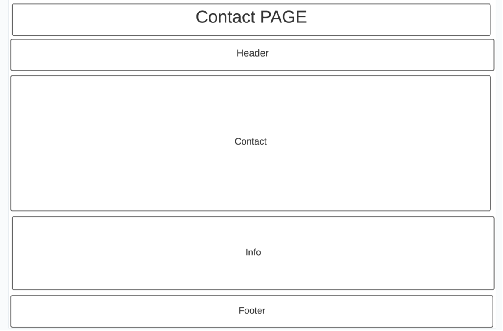

# Development Strategy

> AppTheme

- Your company has recently started on a project that aims to create a company website page. So you and your colleagues have started to work on the project.

## Wireframe

<!-- include a wireframe for your project in this repository, and display it here -->
<!-- wireframe.cc is a good site for getting started with wireframes -->

-

-

-

### Repo

- Generate from Template
- Write initial, basic README
- Turn on GitHub Pages

### Repo

Create branch for each page (index, about, services, contact)

### HTML

Create Html structure on each branch

### CSS

Create Css structure for every page on each branch

### Instruction

1. Create one issue per step, move them to the board
2. For each step:

- move that issue into in progress
- create a new branch locally
- write your new code on that branch
- push the branch to your repository
- create a PR linked to this issue
- merge the PR, closing this step's issue
- move the issue into done
- pull the new master branch to your computer
- continue to the next step

## Finishing Touches

- Write final, complete README:
  - [makeareadme.com](https://www.makeareadme.com/)
  - [bulldogjob](https://bulldogjob.com/news/449-how-to-write-a-good-readme-for-your-github-project)
  - [meakaakka](https://medium.com/@meakaakka/a-beginners-guide-to-writing-a-kickass-readme-7ac01da88ab3)
- Validate code to check for any last mistakes
